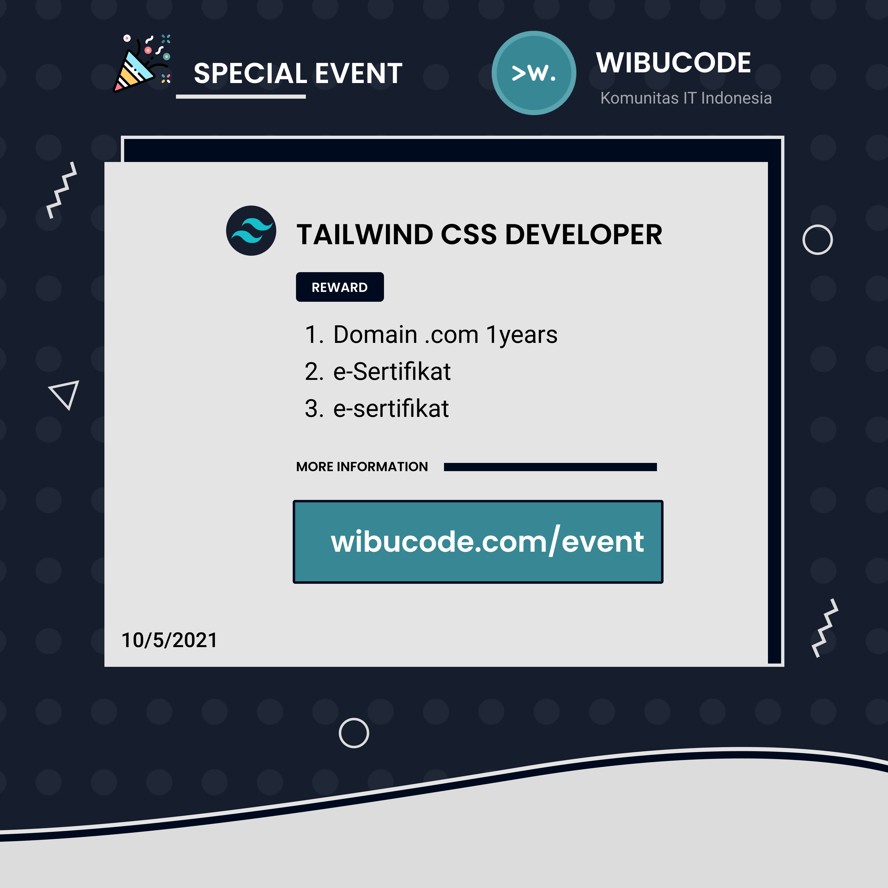

# 🎉 event-tailwindcss-2021
Daftar submission event TailwindCSS 2021

 

___

### 1.rizkimcitra

Izin submit project buat event nya, stack:
- NextJS
- React, Preact for production
- Tailwind CSS

links:
https://rizkimcitra.vercel.app/

public repo:
https://github.com/rizkimcitra/nextjs-portfolio

 

### 2.Huda Damar

Halo semuanya, izin submit event.
saya membuat website cloning  Epic Games Store.
pada website yang saya buat hanya tampilan dan interaksinya saja

dibuat dengan:
- Vite + Vue 3 + Typescript
- Tailwindcss
- Headless UI
- Swiperjs

tampilan yang di buat:
- home (discover, browse)
- signin
- signup

web:
https://epicgames-hd21.netlify.app/

repo:
https://github.com/hudadamar21/epicgames-clone

untuk perbandingan ini website aslinya:
https://epicgames.com/

 

### 3.zerofinding 

https://github.com/zerofinding/nativescript-vue-starter-tailwindcss-ns8-myim3

 

### 4.Kifuat

Halo semuanya
Izin submit website portofolio saya (masih belum selesai)

Dibuat pakai:
- Vite
- React
- Typescript
- Tailwind JIT

web: https://pragusga.com/

repo: https://github.com/pragusga25/pou

 

### 5.rizal_grandonk

Stack :
- React
- NextJS
-Tailwind CSS
-Node
-Strapi (headless CMS)
-Midtransa (payment gateway)

Link Website : https://grandonkmerch.vercel.app/

Link Repository : https://github.com/grandonk666/next-ecommerce

 

### 6.menghatsu

Halo semua, izin mengikuti event Tailwind CSS.

Stack:
-Vite
-Tailwind CSS

Link website: https://4reality-reborn.vercel.app/

Link repo: https://github.com/NikarashiHatsu/4reality-reborn

 

### 7.Ricko V

Ngeblog pakai Markdown.

Izin submit untuk event tailwind.
stack:
- Tailwind CSS
- Nuxt Content
- PWA
- Firebase Hosting

Link: https://kodekembar.web.app/

Repo: https://github.com/ricko-v/kodekembar

 

___

 

# 🎉 Daftar 3 Pemenang Event TailwindCSS

### 1.Huda Damar
### 2.menghatsu
### 3.rizal_grandonk

